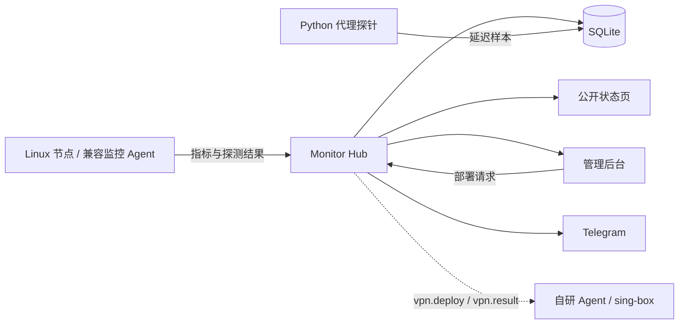

# Monitor

自托管的轻量级服务器监控面板，用一个后台管理多台 Linux 服务器的运行状态、流量、延迟和到期信息，并通过 Telegram 接收告警。

Hub 使用 Rust、axum 和 SQLite，管理后台使用 React 和 TypeScript，公开状态页通过主题提供。后台与默认主题嵌入 Hub 二进制，运行 Hub 不需要额外的 Node.js 服务或独立数据库服务。

本项目基于 [monitor-probe/monitor](https://github.com/monitor-probe/monitor) 开发，增加了定制后台、自研 Agent 和 VPN 部署模块。VPN 部署模块包含指令下发和结果回传；订阅服务及完整安装验收仍需完善，具体状态见下文。

## 能做什么

### 服务器监控

- 集中查看多台服务器的在线状态、系统信息、CPU、负载、内存、磁盘和网络数据。
- 通过 WebSocket 更新公开状态页，查看实时读数和历史趋势。
- 管理节点名称、排序、公开状态及备注；私有节点不出现在公开列表中。
- 为每个节点设置独立 token，并支持轮换 token、批量编辑及安装注册窗口。

Hub 支持的指标与节点实际显示的数据取决于 Agent 上报的字段。仓库内自研 Agent 目前提供一部分指标；不能把 Hub 支持的全部字段等同于 Agent 已上报的字段。

### 流量与服务器账单

- 保存上传、下载流量，显示当前计费周期的用量与额度。
- 支持双向合计、仅上传、仅下载及双向取最大值等计费方式。
- 设置计费起始日、服务器到期日、价格、币种和付费周期，集中查看续费信息。
- 保存资源与延迟历史，通过分钟明细及小时聚合提供不同时间范围的查询。

流量统计来自节点的网络计数器，不是云厂商账单接口；最终计费仍应以服务商记录为准。

### 延迟探测

项目包含两种测量路径，适合不同用途：

| 路径 | 用途 | 工作方式 |
|---|---|---|
| Hub 的探测任务 | 查看节点到指定目标的 TCP 连通性与延迟 | 后台配置目标及间隔，由兼容 Agent 执行并上报 |
| `probe/` 代理探针 | 查看真实代理链路的 HTTP 请求耗时 | Python 调用 curl，经本地 sing-box 的代理出站请求测试地址，再写入 Hub 数据库 |

代理测量包含代理连接和 HTTP 请求过程，不等同于 ICMP ping 或单次 TCP 握手时间。可以为 VLESS、Hysteria2 等出站建立不同曲线。

仓库内自研 Agent 的 `ping.tasks` 处理目前仍是 TODO。`probe/` 是独立的参考实现，需要自行配置出站、数据库路径、节点 ID 与任务 ID，不能直接套用示例中的编号。跳过或删除失败样本会改变丢包统计的含义。

详见 [代理探针说明](probe/README.md)。

### Telegram 告警

- 节点离线与恢复在线提醒。
- 流量阈值和额度用尽提醒。
- 到期与续费提醒。
- 后台登录提醒。
- 自定义通知模板、离线宽限期、流量阈值和到期提前天数，并发送测试消息。

当前定制版本使用 Telegram 通知，需自行配置 Bot Token 和接收 Chat ID。

### 公开状态页与主题

- 公开页和管理后台分开；访客查看公开节点，管理员登录后管理节点与配置。
- 支持开关公开页、安装和切换主题、预览主题以及配置主题提供的选项。
- 可上传主题包，或从 GitHub 主题仓库安装及更新。
- 默认主题在构建时按固定版本和 SHA-256 下载；运行时可使用自定义主题。
- `themes/miku/` 提供初音背景样式及接入说明，需要自行准备图片或视频并整合到主题，默认不启用。

主题效果和配置项由具体主题决定。初音目录不是一个已经包含完整视频资源的主题发行包。参见 [初音主题说明](themes/miku/README.md)。

### 后台管理与数据维护

| 页面 | 主要用途 |
|---|---|
| 节点 | 节点信息、安装入口、token、流量及账单信息 |
| 延迟 | 探测任务、目标、间隔及节点分配 |
| 通知 | Telegram 配置、提醒规则及模板 |
| 数据 | 数据库统计、历史保留设置、备份、恢复和空间整理 |
| 主题 | 安装、预览、切换、更新和主题配置 |
| 安全 | 密码修改、登录会话管理 |
| 网站 | 域名访问状态与 nginx HTTPS 反向代理配置示例 |
| 部署 | 向在线节点发送 VPN 部署指令，查看已保存的部署信息（订阅服务尚未提供） |

密码修改页面要求验证旧密码。网站页面生成的是供管理员执行的配置说明，并不会自动修改服务器 DNS、安装 nginx 或申请证书。

## VPN 部署模块与当前边界

这个模块的目标是从后台选择在线节点，通过 Agent 安装 sing-box，配置 VLESS + REALITY 和 Hysteria2，最终提供 Clash 与 v2rayN 订阅。

当前源码已包含：

- 后台部署页面与管理员部署 API。
- Hub 向节点发送 `vpn.deploy` 指令的通道。
- 自研 Agent 中的 sing-box 安装、凭据生成、配置文件及 systemd 服务写入逻辑。
- VLESS/TCP 443、Hysteria2/UDP 443 的配置生成，以及部署信息的数据库字段和读取 API。

本次发行补齐了 Agent 的 Bearer 鉴权、WebSocket 握手、安装器环境变量读取和 HTTPS 连接支持；Hub 已接入 `vpn.result` 的保存逻辑。部署请求成功表示指令已经发送，实际部署结果仍需等待 Agent 回传。

目前的边界：

- **订阅服务尚未提供**：后台和数据库预留了 Clash、v2rayN 订阅地址，但自研 Agent 当前只生成单节点链接。已有独立订阅服务不由此模块自动接管，也不能凭空生成可用订阅地址。
- **系统服务必须实测**：回执处理与数据保存的验证不能替代目标机器上的 sing-box 启动、实际代理连接和订阅验收。
- **现有配置不会自动迁移**：部署代码会写入 `/etc/sing-box/config.json`、证书和 `sing-box.service`，需要 root 与 systemd；它不是保留现有代理配置的升级工具。

独立运行的既有 VPN 或订阅服务，与本仓库这一部署模块的完成程度应分别判断。

## 项目组成

| 目录或文件 | 作用 |
|---|---|
| `src/` | Rust Hub：HTTP API、WebSocket、鉴权、数据库、通知和主题管理 |
| `web-admin/` | React / TypeScript 管理后台 |
| `agent/` | 自研 Rust Agent：指标采集与 VPN 部署处理，指标与探测实现仍在完善 |
| `probe/` | Python + curl + sing-box 代理延迟探针 |
| `themes/miku/` | 初音主题样式与接入说明 |
| `scripts/theme.sh`、`web-theme.pin` | 默认主题下载与摘要校验 |
| `install-hub.sh`、`install.sh` | Hub 与监控 Agent 安装脚本 |
| `.github/workflows/` | 检查与 Hub 发布工作流 |
| `Dockerfile` | 打包已构建 Hub 二进制的容器镜像 |

Hub 与 Agent 是两个独立进程，运行在不同角色的机器上。本地编译 Hub 不会自动编译 `agent/`；发布工作流分别构建两者。



## 部署与运行

### 环境要求

Hub 和 Agent 以 Linux 为目标环境；Windows 开发可使用 WSL。Hub 的安装器使用 systemd，监控 Agent 安装脚本另包含 OpenRC 支持；自研 Agent 的 VPN 部署逻辑当前依赖 systemd。

源码构建需要 Rust stable、C 编译工具、Node.js 24 / npm，以及 curl、tar、sha256sum 等工具。Node.js 用于构建后台，Hub 运行时不依赖它。初次构建需要访问依赖仓库及默认主题下载地址。

### 方式一：使用发布版本

先查看 [Releases](https://github.com/Isyyyue/monitor/releases) 是否已经提供所需架构的 Hub 二进制、`install-hub.sh` 和 `sha256sums.txt`。只有发布资产存在时，以下安装入口才可使用：

```bash
curl -fsSL https://github.com/Isyyyue/monitor/releases/latest/download/install-hub.sh -o install-hub.sh
chmod +x install-hub.sh
sudo ./install-hub.sh
```

安装器默认使用 `/opt/monitor/monitor-hub` 和 `/opt/monitor/data/`，由 `monitor-hub.service` 管理进程。没有可用 Release 时，请使用源码构建；仓库中的临时构建文件不能替代有版本和摘要的正式发布。

监控 Agent 安装入口与仓库内自研 Agent 并不是自动等价的发行路径。使用前应确认下载源、二进制版本及其与 Hub 的协议兼容性；v1.3.3 的发布流程同时构建 Hub 与自研 Agent 的 x86_64/aarch64 Linux musl 产物，并附带 SHA-256 校验文件。

### 方式二：从源码构建 Hub

```bash
git clone https://github.com/Isyyyue/monitor.git
cd monitor

# 构建管理后台
cd web-admin
npm ci
npm run build
cd ..

# 下载并校验默认主题，再构建 Hub
sh scripts/theme.sh
cargo build --release --locked

# 用单独的数据目录进行本地运行
mkdir -p data
./target/release/monitor-hub \
  --listen 127.0.0.1:28080 \
  --db ./data/monitor.db \
  --themes ./data/themes
```

本地访问：

- 公开页：`http://127.0.0.1:28080/`
- 管理后台：`http://127.0.0.1:28080/admin/`

首次创建数据库时，终端会显示一次随机管理员密码。登录后在安全页修改密码。终端密码标签为“Emergency password”，当前后台使用密码登录。

正式部署到域名时，通过 HTTPS 反向代理访问，并给 Hub 设置 `--site https://your-domain.example`；代理需要转发 WebSocket。网站页面提供配置示例，已有 nginx 或端口分流配置应按现有拓扑整合。

### 自研 Agent 构建

```bash
cd agent
cargo build --release --locked
```

产物是 `agent/target/release/monitor-agent`。这只完成编译；部署前仍应按上文的功能边界验证目标机器。安装器通过 `MONITOR_SERVER`、`MONITOR_TOKEN` 和可选的 `MONITOR_IFACE` 传递配置；也可显式使用 `--server`、`--token`、`--interval` 与 `--iface`。自研 Agent 的 HTTPS 连接要求可信证书，不支持 `--insecure`。

### Hub 常用参数

| 参数 | 作用 |
|---|---|
| `--listen` | 监听地址；建议在反向代理后明确使用回环地址 |
| `--db` | SQLite 数据库路径，默认 `monitor.db` |
| `--themes` | 外部主题目录，默认在数据库旁的 `themes/` |
| `--site` | 节点安装入口使用的站点地址，正式环境使用 HTTPS 域名 |
| `--reset-password` | 重置管理员密码并使现有会话失效，打印新密码后退出 |

日志级别可通过 `MONITOR_LOG` 设置。数据库与主题目录需要持久保存；升级前保留一致的数据库备份、旧二进制和相关服务配置。

## 鉴权与权限边界

- 管理后台使用密码和服务端会话；密码以 Argon2 哈希保存，并有限制登录失败的机制。
- 监控 Agent 主动连接 Hub，不需要开放用于接收 Hub 请求的独立管理端口；节点以独立 token 鉴权。
- 公开 API 与管理员 API 分开，公开节点视图过滤 token、备注等管理字段。
- VPN 部署模块允许 Hub 经现有连接下发具有系统修改能力的指令，因此启用这一模块后，Hub 与具备 root 权限的 Agent 必须按管理入口保护。
- 第三方主题在站点中运行，应仅安装可信来源的主题。VPN 链接、订阅地址、Bot Token 和节点 token 均应作为凭据保管。

## 开发检查

在构建后台和默认主题后，可运行：

```bash
cd web-admin
npm run lint
npm test
cd ..

cargo fmt --all --check
cargo clippy --locked --all-targets -- -D warnings
cargo test --locked
cargo test --locked --manifest-path agent/Cargo.toml
```

这些检查不替代真实 Agent 联调、VPN 连通测试和生产部署验收。默认主题是独立项目，修改公开页通常还需要调整主题，而不仅是 `web-admin/`。

## 许可证

采用 [MIT License](LICENSE)。上游及依赖项目的版权和许可证按各自文件保留。
